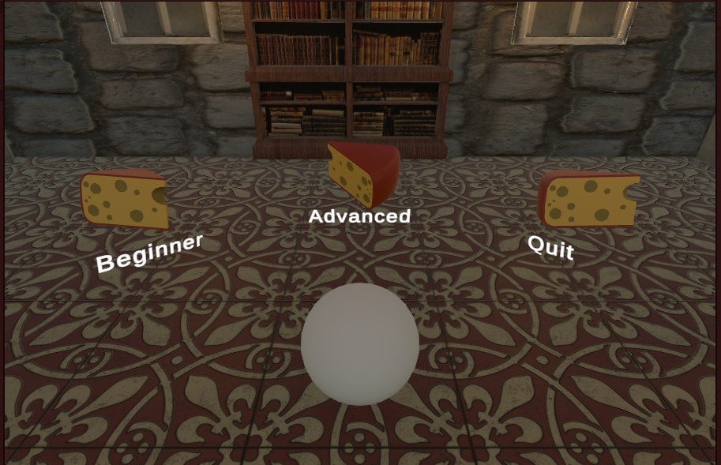

# Roll-a-Ball Game

## Description
Roll-a-Ball is an exciting and fast-paced game set in a medieval room where the objective is to collect as many cheeses as possible. The game features two difficulty levels: Beginner and Advanced. In the Beginner level, players have 15 seconds to collect all the cheeses in the room. In the Advanced level, the challenge is heightened with only 5 seconds at the start to collect the cheeses. For every cheese collected, an additional 2 seconds are added to the clock.



## How to Play
- Use the arrow keys on your keyboard to navigate the ball:
  - Left arrow: Move left
  - Right arrow: Move right
  - Up arrow: Move forward
  - Down arrow: Move backward
- Collect cheese to earn more time. Time ends, you lost! All cheeses collected, you win!
- Plan your moves strategically to maximize cheese collection before time runs out.

## Installation
To play the game, clone the repository and open the project in Unity:

```bash
git clone https://github.com/victorlga/rollaball.git
```

Or go to my itch.io page: https://victorlga.itch.io/roll-a-ball-medieval


## Levels
- **Beginner Level:** Start with 15 seconds to collect all cheeses.
- **Advanced Level:** Start with 5 seconds to collect all cheeses.

## Assets Used
I am grateful to the creators of the assets used in Roll-a-Ball. Below are the credits for these assets:

- **Medieval Room Asset:** Designed by [Omni Studio](https://assetstore.unity.com/packages/3d/environments/free-medieval-room-131004). This beautifully crafted asset forms the enviroment of the game.
- **Cheese Asset:** Created by [Unity Technologies](https://assetstore.unity.com/packages/3d/food-props-163295#publisher). These cheese models are the collectible items in the game.
Contributions to the Roll-a-Ball project are welcome. To contribute, please fork the repository, make your changes, and submit a pull request.
-**Sound Effect Asset:** Created by [Pixabay](https://pixabay.com/sound-effects/munching-food-73994/​). A piece of this audio is played when the ball gets a cheese. 
- **Music Asset:** Created by [Daydreaming of Persephone](https://www.youtube.com/watch?v=vyg5jJrZ42s). The music played in the background.

## Credits
- [Unity Roll A Ball tutorial](https://learn.unity.com/project/roll-a-ball)

## License
This project is licensed under the MIT License - see the LICENSE.md file for details.
